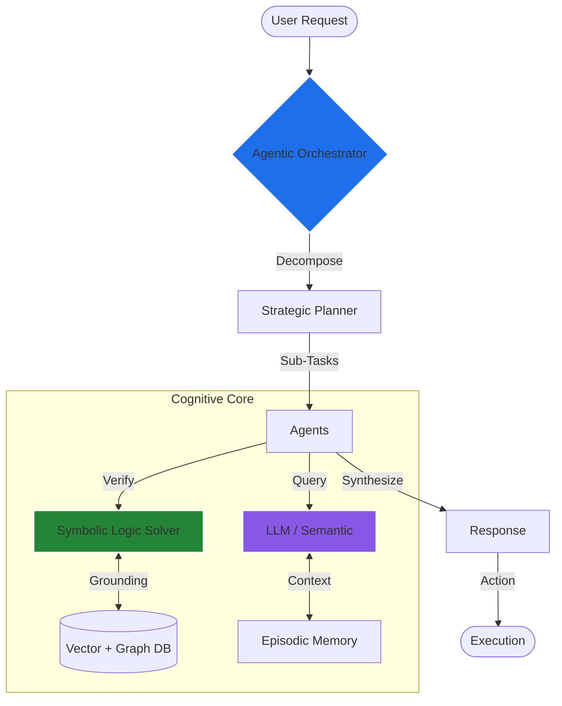

<div align="center">
  
  <br>
  
</div>

<br />

## 🧬 Entity Definition: `AgenticArchitect`

```python
class AgenticArchitect(Researcher):
    def __init__(self):
        self.name = "Jayasurya Mahadevan"
        self.role = "Orchestrator of Intelligent Systems"
        self.focus = [
            "Neuro-Symbolic AI",
            "Multi-Agent Orchestration",
            "Computational Biology"
        ]
        
    def current_mission(self):
        return {
            "objective": "Bridge the gap between LLMs and Symbolic Logic",
            "active_research": "Bio-Inspired Computing & Autonomy",
            "status": "Building the Future"
        }

    def collaborate(self):
        return "Open to elite research collaborations."
```

<br />

## 🧠 System Architecture: Neuro-Symbolic Flow

My work focuses on creating systems that can *reason*, not just predict. This involves orchestrating Large Language Models with symbolic logic solvers and memory engines.



<br />

## 🛠️ Compute Arsenal

<div align="center">
  <table>
    <tr>
      <td align="center"><b>Core Logic</b></td>
      <td align="center"><b>Neural Networks</b></td>
      <td align="center"><b>Infrastructure</b></td>
    </tr>
    <tr>
      <td align="center">
        
        <br>
        
      </td>
      <td align="center">
        
        <br>
        
      </td>
      <td align="center">
        
        <br>
        
      </td>
    </tr>
  </table>
</div>

<br />

## 📊 Telemetry & Metrics

<div align="center">
  
  
</div>

<br />

## 📡 Establish Connection

<div align="center">
  <a href="https://www.linkedin.com/in/jayasuryamahadevan" target="_blank">
    
  </a>
  &nbsp;&nbsp;
  <a href="mailto:jayasuryamahadevan@gmail.com">
    
  </a>
</div>

<br />
<br />
<div align="center">
  <code>_EOF // END OF FILE</code>
</div>
